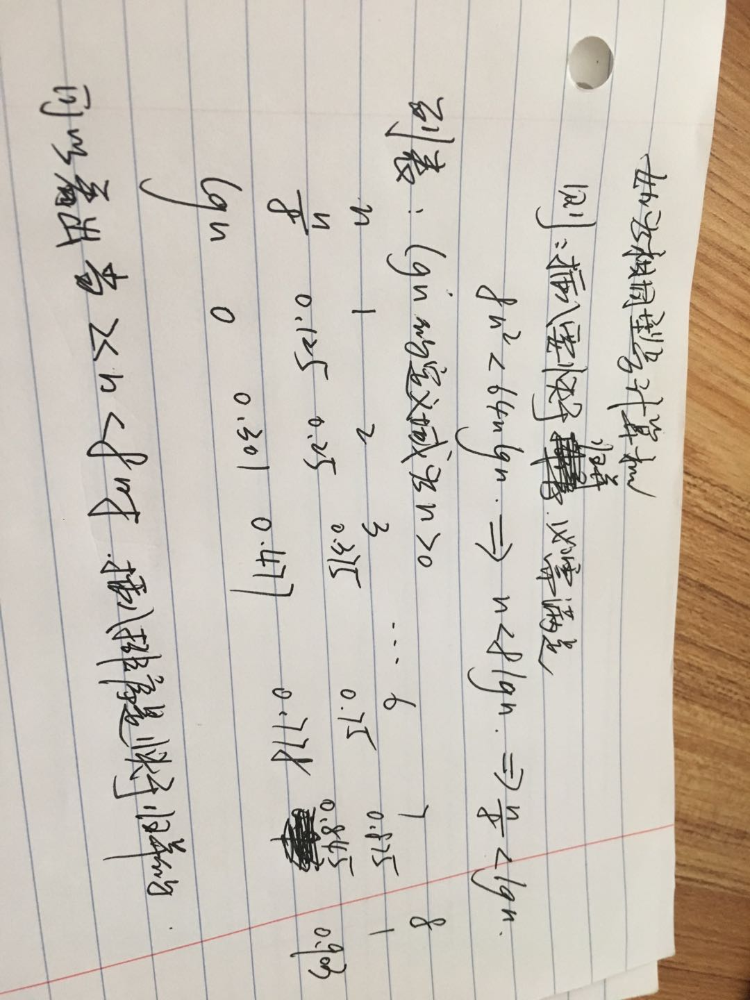
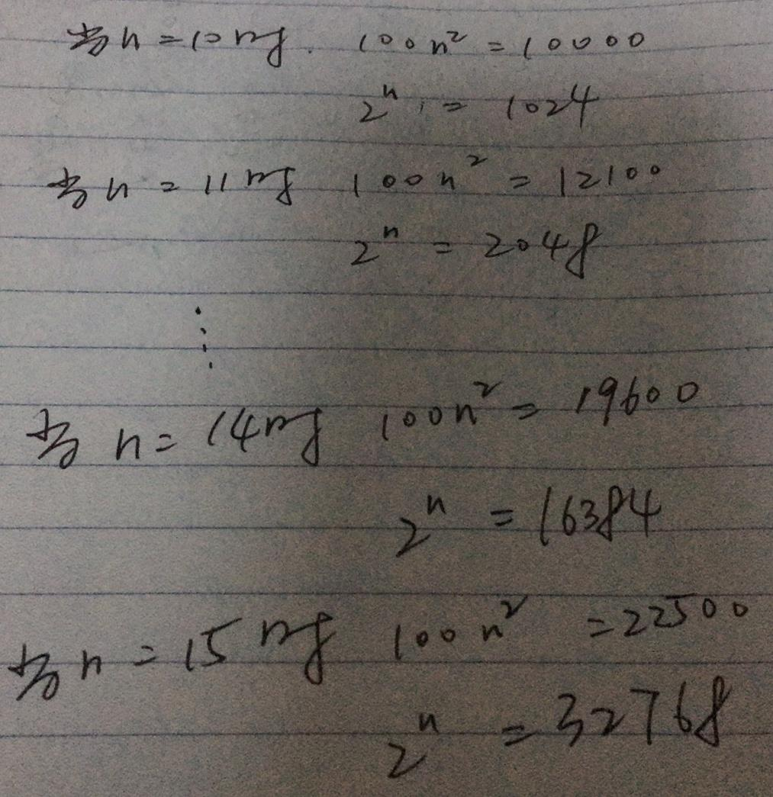

# 算法导论 - 练习答案

## 第一章
### 第一节

> 1.1-1 现实生活中需要排序的例子或者现实生活中需要计算凸壳的例子。
> > 1. 排序的例子有，网上商城购物时，需要对价格，销量，远近等进行排序。
> > 2. 凸壳的例子主要是雷达图，用于比赛选手的实力展示。
> 
> 1.1-2 除速度外，在生活中还有那些有关效率的量度？
> > 发动机的功率等物理或化学量度
> 
> 1.1-3 选择一种你以前已知的数据结构，并说出优势和局限
> > Map, Array, Set 等， Map 典型的 K-V 结构，容易查询，插入和删除。不便于排序，Array 是有序的，易于查询和排序，但不便于插入和删除，Set 方便去重，但无序。
> 
> 1.1-4 最短路径与旅行商问题的异同之处？
> > 两者的共同点是都需要求出点与点之前的最短距离，但是旅行商问题是多点之间的最短距离且要返回原点。
> 
> 1.1-5 提供一个现实生活的问题，其中只有最佳解才行。然后提供一个问题，其中近似最佳的一个解也足够好。
> > 对商品价格和销量的排序必须有最佳解。AI AlphaGO 只需要对下的每一步棋有个概率上的近似最佳解就足够好了。

> 1.2-1 应用层需要算法内容的应用的一个例子，并讨论设计的算法的功能。
> > 应用层汽车导航，最短路径的计算，最短时间计算。
> 
> 1.2-2 假设比较插入排序与归并排序在相同机器上的实现。对规模为 n 的输入，插入排序运行 8n^2步，而归并排序运行64nlg n步。问对那些 n 值，插入排序优于归并排序？
> > 
> 
> 1.2-3 n 的最小值为何值时，运行时间为100n^2 的一个算法在相同机器上快于运行时间为 2^n 的另一个算法？
> > n 的最小值为 15 时，100n^2 的运行便快于 2^n，如图：
> > 
> 
> 思考题
> 1-1  （运行时间比较） 假设求解问题的算法需要 f(n) 毫秒，对下标中的每个函数 f(n) 和时间 t，确定可以在时间 t 内求解的问题的最大规模 n。
>           | 1 秒钟 | 1 分钟 | 1 小时 | 1 天 | 1 月 | 1 年 | 1 世纪 
> ---------   ------  ------   ------   ----  ----   -----  -------