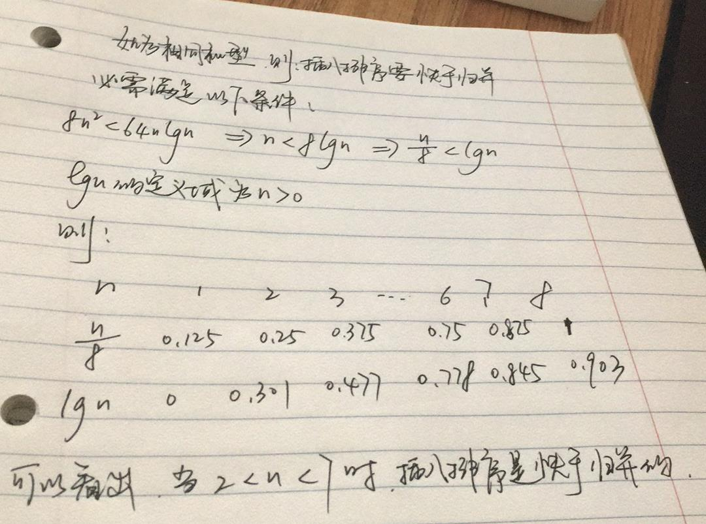

# 算法导论 - 练习答案

## 第一章

> 1.1-1 现实生活中需要排序的例子或者现实生活中需要计算凸壳的例子。
> > 1. 排序的例子有，网上商城购物时，需要对价格，销量，远近等进行排序。
> > 2. 凸壳的例子主要是雷达图，用于比赛选手的实力展示。
> 
> 1.1-2 除速度外，在生活中还有那些有关效率的量度？
> > 发动机的功率等物理或化学量度
> 
> 1.1-3 选择一种你以前已知的数据结构，并说出优势和局限
> > Map, Array, Set 等， Map 典型的 K-V 结构，容易查询，插入和删除。不便于排序，Array 是有序的，易于查询和排序，但不便于插入和删除，Set 方便去重，但无序。
> 
> 1.1-4 最短路径与旅行商问题的异同之处？
> > 两者的共同点是都需要求出点与点之前的最短距离，但是旅行商问题是多点之间的最短距离且要返回原点。
> 
> 1.1-5 提供一个现实生活的问题，其中只有最佳解才行。然后提供一个问题，其中近似最佳的一个解也足够好。
> > 对商品价格和销量的排序必须有最佳解。AI AlphaGO 只需要对下的每一步棋有个概率上的近似最佳解就足够好了。

> 1.2-1 应用层需要算法内容的应用的一个例子，并讨论设计的算法的功能。
> > 应用层汽车导航，最短路径的计算，最短时间计算。
> 
> 1.2-2 假设比较插入排序与归并排序在相同机器上的实现。对规模为 n 的输入，插入排序运行 8n^2步，而归并排序运行64nlg n步。问对那些 n 值，插入排序优于归并排序？
> > 
> 
> 1.2-3 n 的最小值为何值时，运行时间为100n^2 的一个算法在相同机器上快于运行时间为 2^n 的另一个算法？
> > n 的最小值为 15 时，100n^2 的运行便快于 2^n，如图：
> > 
> 
> 思考题
> 1-1  （运行时间比较） 假设求解问题的算法需要 f(n) 毫秒，对下标中的每个函数 f(n) 和时间 t，确定可以在时间 t 内求解的问题的最大规模 n。

<table>
<tr>
<th></th>
<th> 1 秒钟 </th>
<th> 1 分钟 </th>
<th> 1 小时 </th>
<th> 1 天 </th>
<th> 1 月 </th>
<th> 1 年 </th>
<th> 1 世纪 </th>
</tr>
<tr>
<td> lg(n) </td>
<td></td>
<td></td>
<td></td>
<td></td>
<td></td>
<td></td>
<td></td>
</tr>
<tr>
<td> √n </td>
<td></td>
<td></td>
<td></td>
<td></td>
<td></td>
<td></td>
<td></td>
</tr>
<tr>
<td> n </td>
<td></td>
<td></td>
<td></td>
<td></td>
<td></td>
<td></td>
<td></td>
</tr>
<tr>
<td> n lg(n) </td>
<td></td>
<td></td>
<td></td>
<td></td>
<td></td>
<td></td>
<td></td>
</tr>
<tr>
<td> n^2 </td>
<td></td>
<td></td>
<td></td>
<td></td>
<td></td>
<td></td>
<td></td>
</tr>
<tr>
<td> n^3 </td>
<td></td>
<td></td>
<td></td>
<td></td>
<td></td>
<td></td>
<td></td>
</tr>
<tr>
<td> 2^n </td>
<td></td>
<td></td>
<td></td>
<td></td>
<td></td>
<td></td>
<td></td>
</tr>
<tr>
<td> n! </td>
<td></td>
<td></td>
<td></td>
<td></td>
<td></td>
<td></td>
<td></td>
</tr>
</table>

## 第二章
> 2.1-1 说明 INSERTION-SORT 在数组 A=[31, 41, 59, 26, 41, 58] 上的执行过程
> 
> ```
> var A = [31, 41, 59, 26, 41, 58];
> function insertion_sort(arr){
>   let i, j, key;
>   for(j = 1; j < arr.length; j++){
> 	key = arr[j];
>     i = j - 1;
>     // 其中 arr[i] > key 是升序，而 arr[i] < key 是降序
>     while(i >= 0 && arr[i] > key){
>        arr[i+1] = arr[i];
>        i -= 1;
>     }
>     arr[i+1] = key;
>   }
>   return arr;
> }
> insertion_sort(A) // [26, 31, 41, 41, 58, 59]
> ```
> 2.1-2 重写过程 INSERTION-SORT，使之按非升序排序
> > 参考 2.1-1
> 
> 2.1-3 考虑一下查找问题：
> 输入： n 个数的一个序列 A=[a1, a2, ...., an] 和一个值 v。  
> 输出：下标 i 使得 v=A[i] 或当 v 不在 A 中出现时，v 为特殊值 NIL。  
> 写出线性查找伪代码，它扫描这个序列来查找 v。使用一个循环不变式来证明你的算法是正确的。确保你的循环不变式满足三个必要的性质。  
> ```
> A=[a1, a2, ...., an]
> v=ai
> for i = 1 to A.length
>     if v == A[i] 
>         return i
> v=NIL
> ```
> 
> 2.1-4 考虑吧两个 n 位二进制整数加起来的问题，这两个整数分别存储在连个 n 元数组 A 和 B 中。这两个整数的和应该按二进制形式存储在一个(n+1)元数组 C 中。请给出该问题的形式化描述，并写出伪代码。
> 
> ```
> function binary_add(a, b){
> 	var key = 0, c = new Array(a.length);
>     for(var i = a.length-1; i >= 0; i--){
> 		c[i] = a[i] + b[i] + key;
> 		if(c[i] >= 2) key = 1;
> 		else key = 0;
> 		if(c[i] % 2 == 0) c[i] = 0;
> 		else c[i] = 1;
> 	}
>   if(key == 1) c.unshift(key);
> 	return c;
> }
> binary_add([1,0,1,0,1], [1,1,0,0,1]); // [1, 0, 1, 1, 1, 0]
> ```